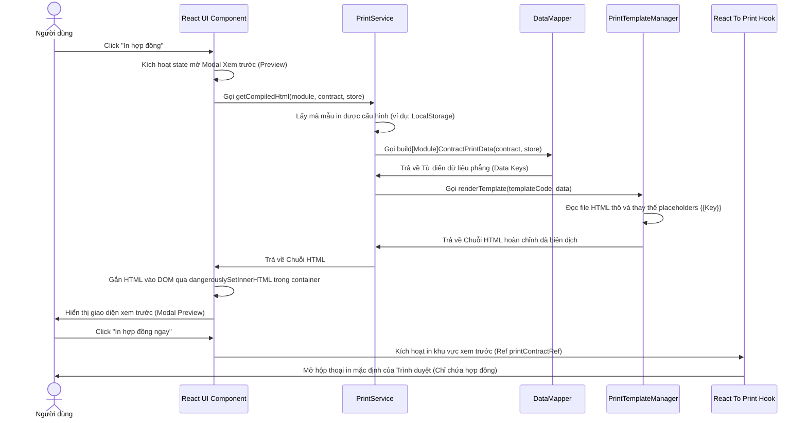

# Luồng xử lý In ấn (Print Flow Sequence) - HungTin

Tài liệu này mô tả chi tiết luồng xử lý dữ liệu và kích hoạt tính năng in ấn từ khi người dùng click trên UI cho tới khi bản in xuất ra máy in vật lý.

## Biểu đồ Luồng Xử lý (Sequence Diagram)

## Các Bước Chi tiết trong Luồng

### Bước 1: Kích hoạt xem trước trên UI
Khi người dùng click vào tùy chọn "In hợp đồng" trên danh sách hợp đồng hoặc trong trang chi tiết hợp đồng:
* State `activePrintContract` (trên danh sách) hoặc `isPrintModalOpen` (trên trang chi tiết) được gán làm `true`.
* Hàm render của Component React sẽ chạy để dựng cấu trúc Modal.

### Bước 2: Biên dịch dữ liệu & HTML (PrintService)
Trước khi Modal hiển thị, hàm `getCompiledHtml` trong `PrintService.ts` được triệu gọi:
1. **Lấy cấu hình mẫu in**: Kiểm tra trong `localStorage` xem người dùng đang chọn mẫu in nào (ví dụ: lãi suất hay thỏa thuận đối với Cầm đồ), nếu không có sẽ lấy mẫu in mặc định cho phân hệ đó qua `getDefaultTemplateCode`.
2. **Chuẩn hóa dữ liệu (DataMapper)**: Dữ liệu hợp đồng thô được chuyển qua các hàm Mapper tương ứng trong `DataMapper.ts` để sinh ra bộ từ khóa phẳng. Tất cả dữ liệu tiền tệ được chuyển thành dạng dấu phẩy phân tách và số tiền lớn nhất sẽ được dịch tự động sang chữ tiếng Việt.
3. **Thay thế biến mẫu (TemplateManager)**: Các mã placeholders `{{Key}}` trong tệp HTML mẫu thô sẽ được thay thế bằng Regex. Đối với hợp đồng trả góp, nếu không có thẻ chứa bảng lịch thanh toán, manager sẽ tự động phát hiện và chèn bảng lịch trình góp ngay trước phần ký tên.

### Bước 3: Render xem trước chuyên nghiệp
* Kết quả HTML được truyền vào phần tử `dangerouslySetInnerHTML` nằm trong thẻ div preview có lớp CSS định dạng khổ giấy A4, font Serif rõ nét để người dùng có thể xem trước chính xác những gì sẽ in ra.

### Bước 4: In không dùng giao diện web (React-To-Print)
* Khi người dùng nhấn nút "In ngay", thư viện `react-to-print` sẽ lấy tham chiếu trực tiếp đến `printContractRef` (vùng preview hợp đồng).
* Thư viện tạo một iFrame tạm thời ẩn trên trang, sao chép toàn bộ HTML hợp đồng và CSS in ấn vào đó và gọi `window.print()` trên iFrame đó. Trình duyệt sẽ chỉ hiển thị nội dung hợp đồng sạch đẹp, không chứa các thanh menu hay button của ứng dụng web.
